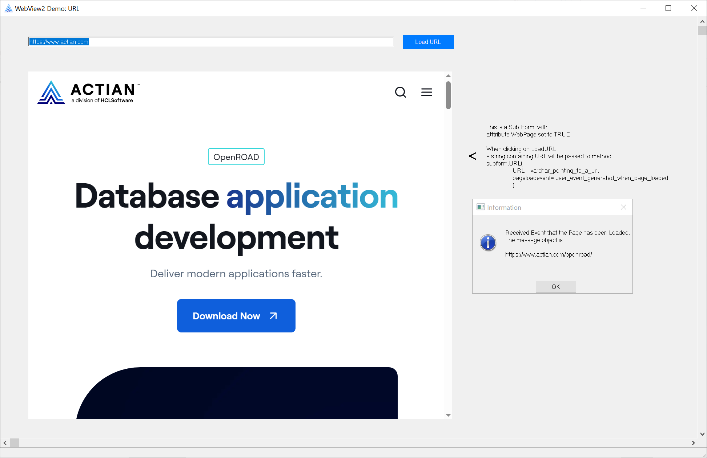
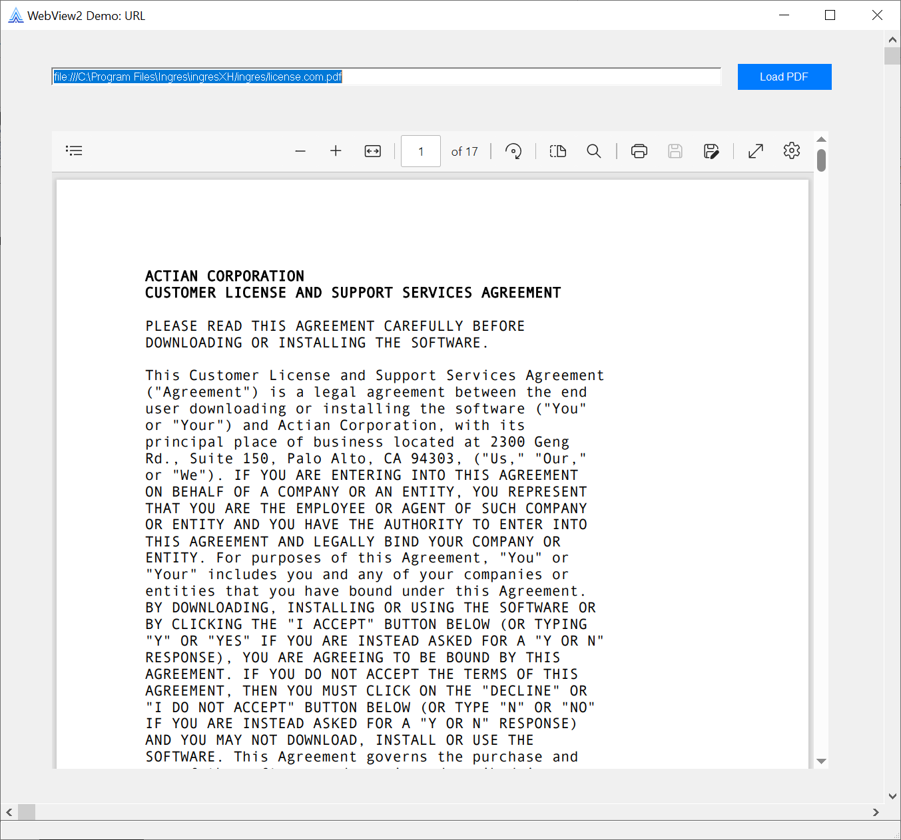
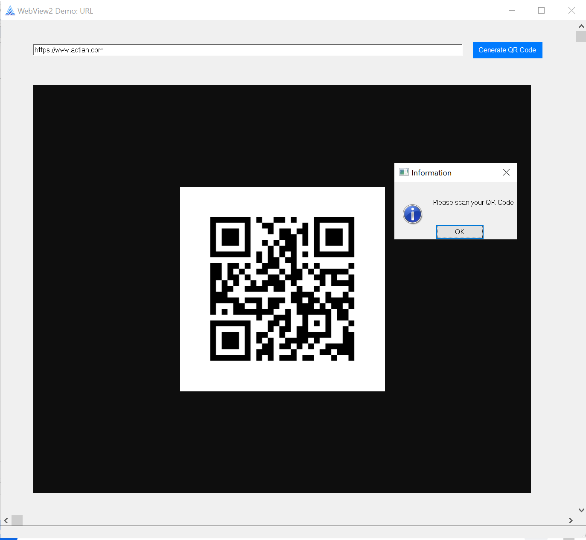
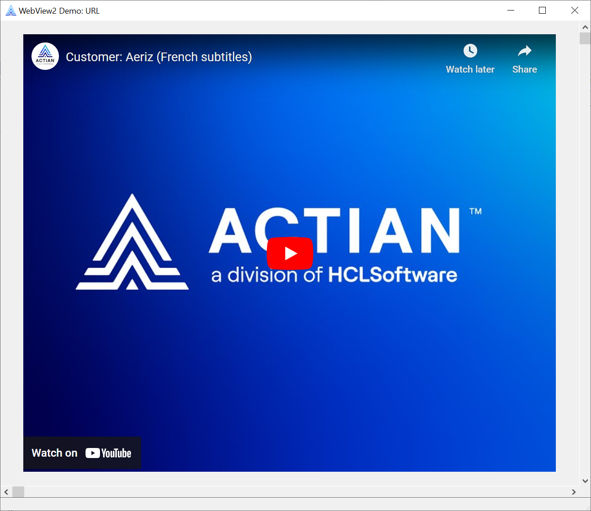

# OpenROAD_sample_WebView2

OpenROAD sample code for WebView2.

WebDemos.xml is an Application Export in (indented) XML format.
Import WebDemos.xml into Workbench to experiment with the sample code.

## Samples

### WebView2Demo

Web browser demo; address bar and button implemented in OpenROAD 4gl with a fixed-sized WebView2.

### WebView2Demo_html_callback

Injects HTML into WebView2.
Does NOT require internet access.

### WebView2Demo_PDF

PDF viewer.

### WebView2Demo_PDF_resize

PDF viewer with resizable window.

### WebView2Demo_QRcode

Displays a QR code using contents of OpenROAD entry field.

NOTE makes use of Google Chart API, this could be reimplemented
without internet access by using the same technique as the
WebView2Demo_html_callback demo and local js.

### WebView2TwoViews

Has two seperate WebView2 viewports, from different websites mixing both html injection and URL loading.

### WebView2VideoHTML_YouTube

HTML injection of a YouTube video, also see WebView2VideoURL_YouTube.

### WebView2VideoURL_actian

URL loading a video from Actian Academy https://academy.actian.com/

### WebView2VideoURL_YouTube

URL loading of a YouTube video, also see WebView2VideoHTML_YouTube.

